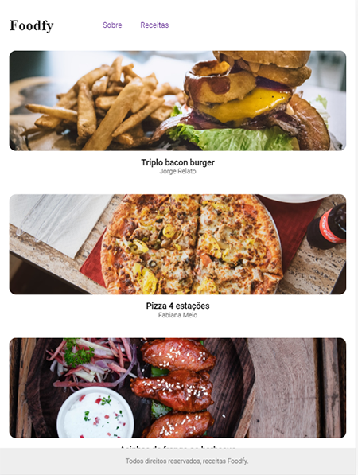
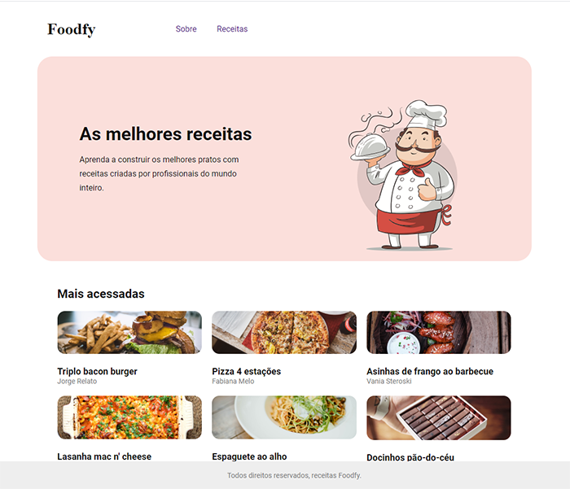
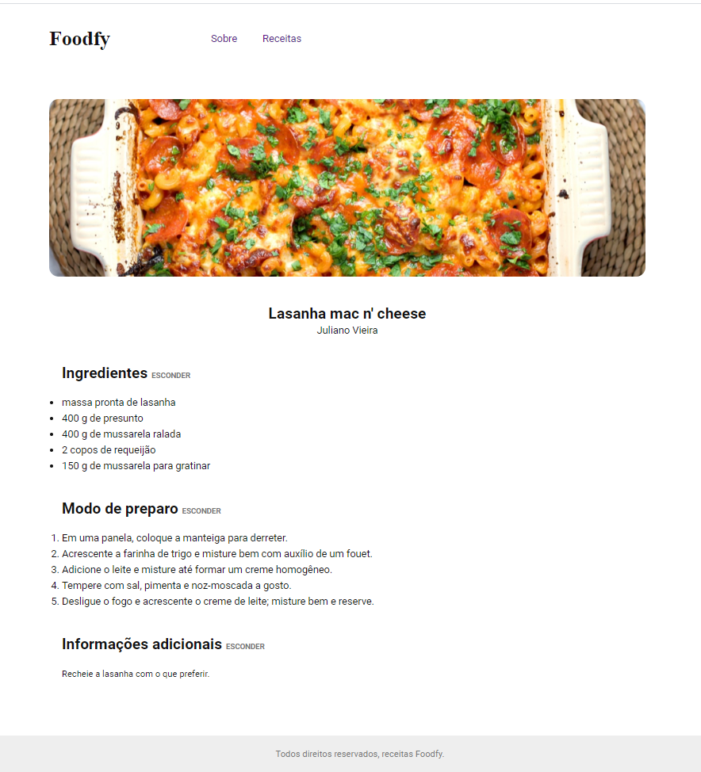

# Foodfy-rocketseat
Made with express and nunjucks - Foodfy 🍕


<p align="center">
   
</p>

********************************

<p align="center">
 
</p>
 
<p align="center">
    
</p>

********************************


# Foodfy


[](https://github.com/maiconboer)


# :construction_worker: Installation

**You need to install [Node.js] and [NPM] first, then, clone the repository:**

```git clone https://github.com/maiconboer/foodfy-rocketseat.git```

**Install dependencies**

```npm install```  
(express and nunjucks)


# :runner: Getting Started


**to start, run the command:**

npm start

The server will be running on port 5000

In your browser, enter the following url:

```http://localhost:5000/```

or

```http://127.0.0.1:5000/```

